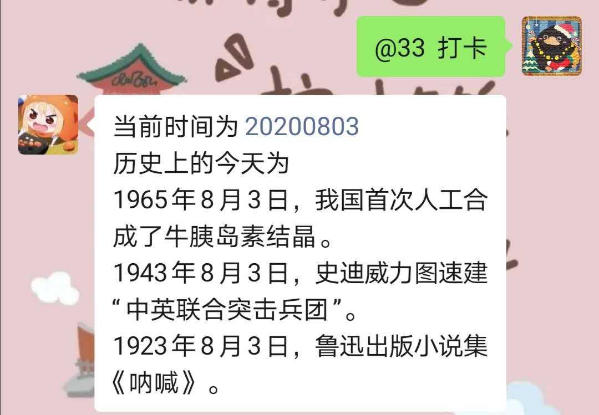
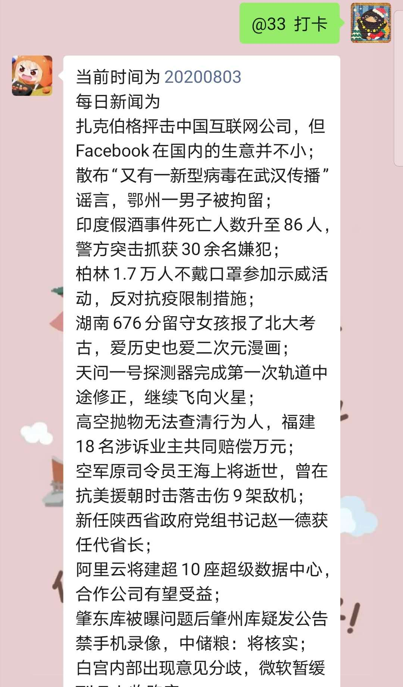
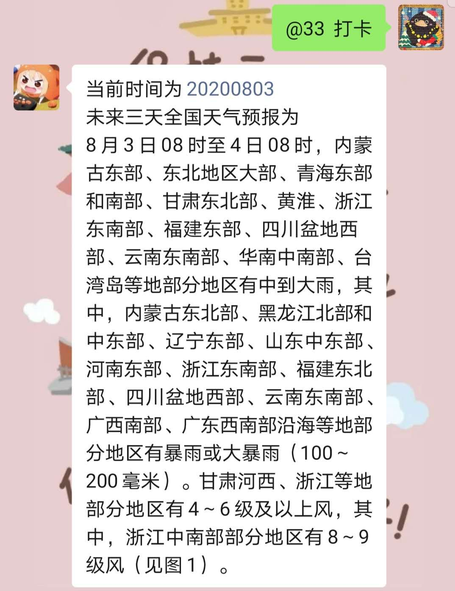
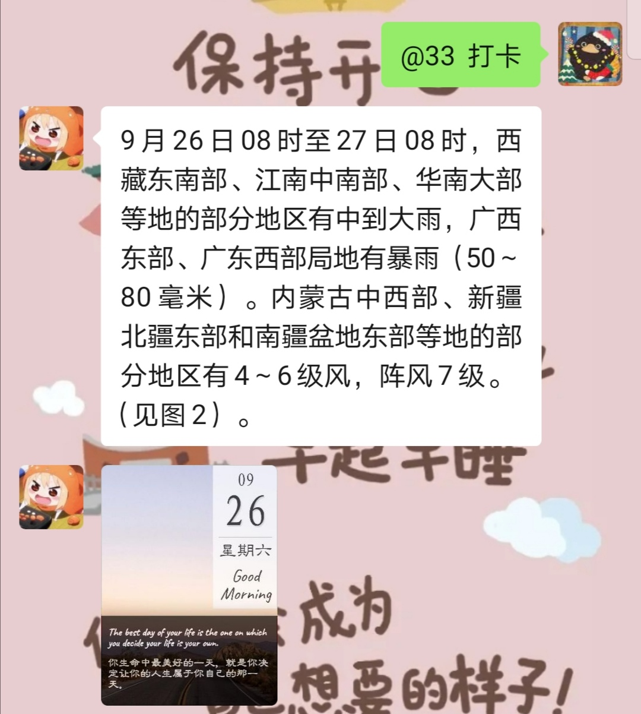

# Words per Day-wechaty 每日一句插件


## 1. 安装使用

```javascript
const { Wechaty, log} = require("wechaty");
const { WordsPerDay} = require("words-per-day");
const bot = new Wechaty();
bot
  .use(WordsPerDay(/*config*/))
  .on("login", (user) => log.info("Bot", `${user.name()} logined`))
  .on("logout", (user) => log.info("Bot", `${user.name()} logouted`))
  .on("error", (e) => log.info("Bot", "error: %s", e));
bot.start();
```

## 2. 自定义数据来源

可以自定义获取数据来源的函数，函数的类型如下：

```javascript
export interface getWordsFunc {
  (): Promise<string>;
}
```

jsonpath的语法可参考：

* <https://www.npmjs.com/package/JSONPath>
* <https://jsonpath.com/>

```javascript
async function getDailyEnglish(){
    return getWords(
        Theme.JSON,
        'https://apiv3.shanbay.com/weapps/dailyquote/quote/',
        ['content', 'translation']
    );
}

const config = {
  rooms: ["打卡群"],// 作用每日一句的群名列表
  sendTime: "13:02",// 自动发送每日一句的时间
  trigger: "打卡",// 群内触发每日一句生成图片的关键词
  imageDir: 'image',//本地保存图片文件的路径
  imageStyle: 0, // 打卡图片的风格,只有0和1两种
  name: '每日英语',// 每日一句数据源的名称
  func: getDailyEnglish // 每日一句数据源的函数名
};
```

## 3.效果截图

### 1. 定时发送信息



### 2. 根据关键词回复打卡图片

打卡图片的生成

#### 2.1 风格1

每次生成的打卡图片颜色不同


打卡图片的具体样式如下，显示打卡用户的头像和名字


#### 2.2  风格2



打卡图片的具体样式如下

