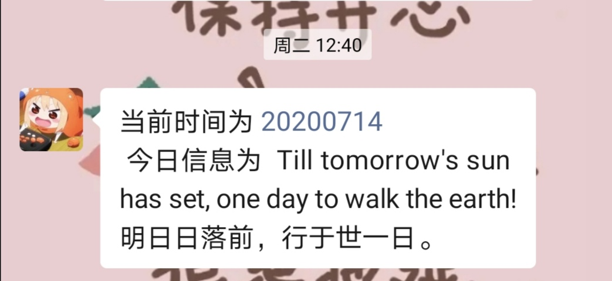
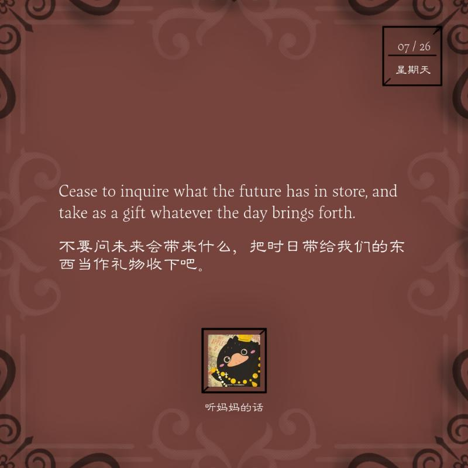

# DailyPlugin

wechaty 每日一句插件

## 安装使用

```javascript
const { Wechaty, log} = require("wechaty");
const { WordsPerDay} = require("words-per-day");
const bot = new Wechaty();
bot
  .use(WordsPerDay(/*config*/))
  .on("login", (user) => log.info("Bot", `${user.name()} logined`))
  .on("logout", (user) => log.info("Bot", `${user.name()} logouted`))
  .on("error", (e) => log.info("Bot", "error: %s", e));
bot.start();
```

## 参数

```javascript
const config = {
  rooms: ["打卡群"],// 作用每日一句的群名列表
  sendTime: "13:02",// 自动发送每日一句的时间
  trigger: "打卡",// 群内触发每日一句生成图片的关键词
  type: 0,// 每日一句的类型，目前只支持English
  imageDir: 'image'//本地保存图片文件的路径
};
```

## 效果截图

### 1. 定时发送信息



### 2. 根据关键词回复打卡图片

每次生成的打卡图片颜色不同


打卡图片的具体样式如下，显示打卡用户的头像和名字

